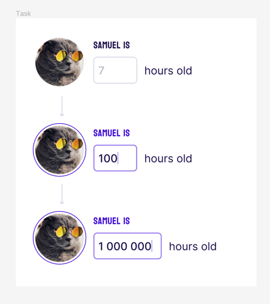

Goal
## Create a numeric input component.

## Install
pnpm i

## start
pnpm run dev

Conception:
1. First of all i added vue router and pinia to the project
2. I've added a layout system and created a types folders for typescript interfaces that can be imported into components
3. I used composables folder for functions that can be encapsulated and reused
4. i used classes instead of tailwind classes in the template. Use classes is a better way to keep the html as clean as possible.
5. As requested, I thought about the project in a completely different way. You'll find 2 different components. The "alternative" one is the default one as requested.
6. You will be first redirected to the welcome page by the router if you're not "logged in". That's mean that I imagined the project as a conversion tunnel that brings the user from the login form to the main page of the website. Pinia was useful for that. So i felt free to code a dynamicle and animated form first.
7. Finally the alternative page matches what you're looking form. A fully reusable component that you can import wherever you want. 
8. You can navigate between these 2 forms with the link located under the main title ("skip and go to ..."")

[Figma](https://www.figma.com/file/OcyCt22I1Ha3fgLzGi0ZZy/Front-end-UI-Task?type=design&node-id=1-4&mode=design&t=ZzZ3vo84xwZ6uxJF-0)

1. The user should only be able to enter digits.
2. Groups of 3 digits should be separated by spaces ("1442" → "1 442").
3. Starting at a width of 72 px, the input should adapt to the size of the entered value.
4. From the existing input, you need to create a component that you can reuse it in other parts of the
project.

You can modify this project as you see fit to match a "production ready" state
